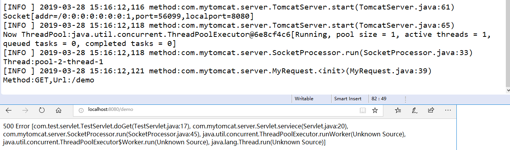

# 手写Tomcat
   ## 概述：
   本项目是为了探究Tomcat底层原理，在学习之余自己实现了一个乞丐版Tomcat。目前主流的通信技术有WebSocket、NIO、Netty，本项目选择WebSocket进行实现
   ## 功能实现：
   1.项目紧依赖于log4j日志包和dom4j解析xml包 
   2.实现了静态页面请求。 
   3.实现了Servlet处理请求。 
   4.可以读取web.xml中的ServletMapping。 
   5.可以在server.properties中设置端口号及线程池大小，对Tomcat进行初始化 
   6.对于不同的客户端Socket，用线程池进行处理。 
   7.对不存在页面的404处理，页面异常的500处理 
   ## 功能展示：
   ### 这是项目结构：
   

   ### 项目启动：
   

   ### 处理静态页面：
   

   ### 处理Servlet：
   

   ### 自定义的web.xml结构为:
   

   ### 处理404：
   

   ### 处理500：
   

